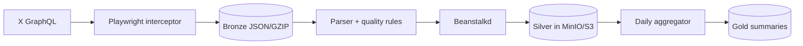

# X Medallion Data Pipeline

An event-time-aware data pipeline that captures X/Twitter GraphQL responses, preserves raw Bronze batches, normalizes posts into an idempotent Silver layer, and produces daily Gold summaries for narrative-trend dashboards.


## Architecture



| Layer | Storage layout | Purpose |
|---|---|---|
| Bronze | `raw_batches/twitter-batch-*.json.gz` | Lossless compressed GraphQL payload archive |
| Silver | `silver/platform=x/year=YYYY/month=MM/day=DD/{post_id}.json` | Normalized post records partitioned by event date |
| Gold | `gold/narrative-trends/date=YYYY-MM-DD/summary.json` | Dashboard-ready daily narrative, hashtag, engagement, and hourly metrics |

## Reliability and data-quality behavior

- Every pending Bronze JSON file is processed oldest-first; successful files are atomically compressed.
- Silver keys use immutable `platform + post_id`, so author-name changes do not create duplicate objects.
- Date partitions use the post timestamp and `DATA_TIMEZONE`, not worker execution time.
- Failed S3 writes are released back to Beanstalkd; malformed payloads are buried for inspection.
- `CONTENT_FILTER_MODE=balanced` keeps legitimate reporting about sensitive subjects and attaches `quality_flags`, while blocking strong promotional or solicitation patterns.
- `observe` retains every non-empty post; `strict` blocks every sensitive-category match.

## Requirements

- Python 3.11+
- A Beanstalkd service
- MinIO or another S3-compatible object store
- An X account/session that is authorized to access the pages being captured

## Setup

```bash
git clone https://github.com/baihaqii08/X-Medallion-Data-Pipeline.git
cd X-Medallion-Data-Pipeline
python -m venv .venv
```

Activate the environment:

```text
Windows PowerShell: .\.venv\Scripts\Activate.ps1
Linux/macOS:        source .venv/bin/activate
```

Install dependencies and the Playwright browser:

```bash
python -m pip install -r requirements.txt
playwright install chromium
```

Copy `.env.example` to `.env`, then replace the placeholder credentials. The application deliberately has no built-in storage password or public tunnel fallback.

```text
TWITTER_AUTH_TOKEN=...
TWITTER_CT0=...
S3_ENDPOINT=http://127.0.0.1:9000
MINIO_ACCESS_KEY=...
MINIO_SECRET_KEY=...
MINIO_BUCKET_NAME=narrative-datalake
DATA_TIMEZONE=Asia/Jakarta
```

`TWITTER_BROWSER_CHANNEL` is optional. Leave it empty to use Playwright Chromium, or set it to `msedge` when Microsoft Edge is installed locally.

## Run

Start the queue-to-Silver worker in the first terminal:

```bash
python minio_worker.py
```

Run a single extraction and parsing cycle in the second terminal:

```bash
python auto_pipeline.py --once
```

Run the persistent scheduler using `PIPELINE_SCHEDULE` and `GOLD_SCHEDULE`:

```bash
python auto_pipeline.py
```

Build or rebuild a Gold summary manually after the queue has drained:

```bash
python gold_aggregator.py --date 2026-09-01
```

Gold generation is idempotent: rebuilding the same date replaces that date's `summary.json`.

## Testing

```bash
python -m unittest discover -v
```

The GitHub Actions workflow runs compilation and unit tests on every pull request and every push to `main`.

## Operational notes

- Keep `.env` and `twitter_profile/` private; both can contain account secrets or session state.
- X/Twitter response schemas can change. A successful network capture does not guarantee every response contains a tweet node, so monitor extracted and published counts.
- Run only collection activities that comply with the platform's terms, applicable law, and your organization's authorization.
