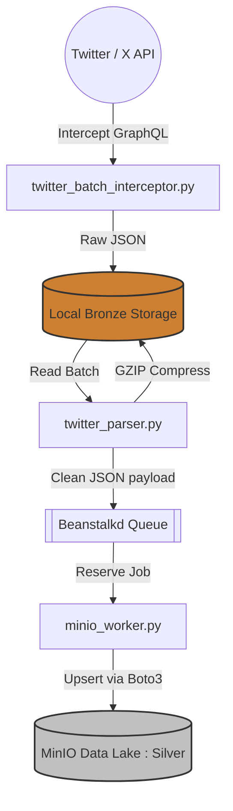

# 🚀 Automated Medallion Data Pipeline (Twitter to MinIO)


A robust, enterprise-grade Data Engineering pipeline designed to autonomously intercept, parse, clean, and store high-volume social media data. This project implements the **Medallion Architecture (Bronze & Silver layers)**, utilizing asynchronous message queues and upsert logic to ensure data integrity and zero duplication.

## ✨ Key Features
- **Network Request Interception:** Bypasses traditional HTML scraping by using Playwright to intercept raw GraphQL API responses, ensuring 100% accuracy and speed.
- **Auto-Scheduling & Frequency Scaling:** Designed to run intelligently (e.g., every 1.5 hours) to maximize data harvesting while remaining undetected by anti-bot systems.
- **Distributed Message Queue:** Implements `Beanstalkd` to decouple the data extraction (Scraper) from the data loading (Worker), ensuring fault tolerance.
- **Upsert Deduplication Logic:** Uses unique `post_id` as S3 Object Keys in MinIO, preventing data duplication while keeping engagement metrics (likes/comments) updated in real-time.
- **Bronze Layer Compression:** Automatically GZIP compresses raw JSON payloads to save 90% of local disk space while maintaining raw historical data.
- **Data Validation:** Built-in validation module to filter out NSFW content and spam bots before entering the Silver layer.

## 🏗️ Architecture Flow



1. `auto_pipeline.py` triggers the execution based on a scheduled cron-like loop.
2. `twitter_batch_interceptor.py` (Scraper) mines Twitter Trends via Playwright and dumps the raw JSON into the local `raw_batches` folder (Bronze Layer).
3. `twitter_parser.py` (Parser) reads the raw batch, normalizes the schema (TikTok unified schema), and pushes it to `Beanstalkd` tube. It then GZIPs the raw file.
4. `minio_worker.py` (Worker) listens to Beanstalkd, pulls the normalized data, and uploads it to a remote MinIO Data Lake via Ngrok (Silver Layer).

## 🚀 How to Run (Local Setup)

1. Clone this repository.
2. Create a virtual environment and install dependencies:
   ```bash
   python -m venv .venv
   source .venv/Scripts/activate
   pip install -r requirements.txt
   playwright install chromium
   ```
3. Copy `.env.example` to `.env` (or create one) and fill in your Twitter Cookies (`auth_token` and `ct0`) and MinIO credentials.
4. Start your local Beanstalkd service (via Docker).
5. Start the MinIO Worker in Terminal 1:
   ```bash
   python minio_worker.py
   ```
6. Start the Automated Pipeline in Terminal 2:
   ```bash
   python auto_pipeline.py
   ```

## 🛡️ Disclaimer
This project was built as a Data Engineering portfolio piece. All sensitive configurations and credentials have been strictly ignored via `.gitignore` and `.env`. 
