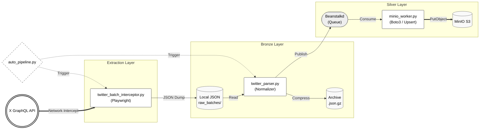

# Automated Medallion Data Pipeline (X/Twitter to MinIO)


A data engineering pipeline designed to intercept X (Twitter) GraphQL payloads and orchestrate data flow into a MinIO object storage backend utilizing a Medallion architecture. The system relies on asynchronous message queues for decoupling and implements deterministic object keys for idempotent upserts.

## Architecture



## Features
- **GraphQL Interception:** Utilizes Playwright to capture raw network responses, bypassing DOM traversal.
- **Message Queue Decoupling:** Employs Beanstalkd to separate extraction workloads from I/O bound loading operations.
- **Idempotency:** Implements deterministic S3 object key generation (`post_id`) to ensure upsert behavior and prevent data duplication.
- **Storage Optimization:** Applies GZIP compression on raw Bronze layer JSON payloads.
- **Validation Pipeline:** Integrates a regex-based validation module to filter out NSFW and predefined negative keywords before entering the Silver layer.

## System Requirements
- Python 3.11+
- Beanstalkd daemon
- MinIO instance (or AWS S3 credentials)

## Local Setup

1. Clone the repository and configure the virtual environment:
   ```bash
   python -m venv .venv
   source .venv/Scripts/activate
   pip install -r requirements.txt
   playwright install chromium
   ```
2. Configure environment variables:
   ```bash
   cp .env.example .env
   ```
   Provide valid Twitter authentication cookies (`TWITTER_AUTH_TOKEN`, `TWITTER_CT0`) and S3 endpoint credentials in the `.env` file.
   
3. Execute the worker process (Terminal 1):
   ```bash
   python minio_worker.py
   ```
   
4. Execute the pipeline scheduler (Terminal 2):
   ```bash
   python auto_pipeline.py
   ```
